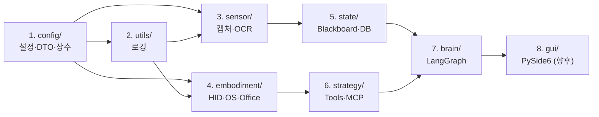

# Desktop Pet Agent — Development Plan (개발 계획서)

> **버전**: 1.0  
> **최종 수정**: 2026-03-24  
---

## 1. 개발 전략 개요

### 1-1. 단계별 접근 (Phase 분리)

| Phase | 목표 | 핵심 산출물 |
|-------|------|-----------| 
| **Phase 1** | 코어 에이전트 파이프라인 | 화면 인식 → LangGraph 추론 → HID/API 실행 |
| **Phase 2** | UI 및 확장 기능 | PySide6 펫 윈도우, STT/TTS, 외부 DB |

### 1-2. Phase 1 핵심 원칙

1. **에이전트 코어 우선**: GUI 없이 CLI/스크립트로 명령 입력 → 실행 → 결과 확인
2. **Bottom-Up 구축**: 하위 모듈(config, sensor, embodiment) → 상위 모듈(brain, strategy)
3. **하드코딩 우선**: LLM 통합 전에 하드코딩으로 전체 파이프라인 동작 검증
4. **안전 최우선**: Kill Switch는 다른 모든 기능보다 먼저 구현 및 테스트

---

## 2. Phase 1 — 주별 추천 수행단계

> Phase 1은 4주차로 구성되며, 각 주차별로 선택 가능한 수행 목록입니다.  
> 개발 상황에 맞춰 원하는 수행 목록을 선택하여 진행할 수 있습니다.

### 1주차 — 에이전트 코어 + Word 자동화 + Kill Switch

> **목표**: LangGraph + MCP 기반 에이전트 골격 구축, pywin32 COM 기반 Word CRUD, 하드웨어 킬 스위치

| # | 작업 | 구현 파일 | 산출물 / 완료 기준 | 상태 |
|---|------|----------|-------------------|------|
| 1 | 프로젝트 뼈대 생성 | 전체 폴더 구조, `__init__.py` | 폴더/모듈 생성 + import 에러 없음 | 0324구현 완료 |
| 2 | 패키지 설치 (conda desktoppet) | — | 1주차 필수 라이브러리 설치 완료 | 0324구현 완료 |
| 3 | 전역 설정 모듈 (PydanticV2) | `config/settings.py` | `.env` 로드 → `AppSettings` 인스턴스 생성 확인 | 0324구현 완료 |
| 4 | DTO 정의 (PydanticV2) | `config/types_dto.py` | 모든 Pydantic 모델 직렬화/역직렬화 테스트 | 0324구현 완료 |
| 5 | 열거형 상수 정의 | `config/constants.py` | AgentStatus, ToolCategory, ErrorCode 등 | 0324구현 완료 |
| 6 | 로깅 시스템 | `utils/logger.py` | 콘솔 + 파일 로그 이중 출력 확인 | 0324구현 완료 |
| 7 | **Kill Switch (우클릭 10회)** | `embodiment/kill_switch.py` | pynput 마우스 우클릭 10회 연타(1.5초) → 프로세스 종료 | 0324구현 완료 |
| 8 | **Word 문서 CRUD (COM)** | `embodiment/office_toolkit.py` | pywin32 COM Visible=True, 문서 작성/수정/삭제 | 0324구현 완료 |
| 9 | **MCP 클라이언트** | `strategy/mcp_client.py` | langchain-mcp-adapters 기반 MCP 서버 연결 | 0324구현 완료 |
| 10 | **도구 레지스트리** | `strategy/tool_registry.py` | 로컬 도구 + MCP 도구 통합 관리 | 0324구현 완료 |
| 11 | **로컬 도구 (Word + 유틸)** | `strategy/local_tools.py` | @tool Word CRUD + wait_seconds | 0324구현 완료 |
| 12 | **LangGraph 상태 정의** | `brain/graph_state.py` | AgentGraphState TypedDict | 0324구현 완료 |
| 13 | **시스템 프롬프트** | `brain/prompts.py` | LLM 페르소나 + 도구 사용 가이드라인 | 0324구현 완료 |
| 14 | **Reasoning 노드** | `brain/nodes/reasoning_node.py` | ChatOllama ↔ LLM 호출 + AIMessage 반환 | 0324구현 완료 |
| 15 | **Tool 노드** | `brain/nodes/tool_node.py` | tool_call 파싱 → 도구 실행 → ToolMessage 반환 | 0324구현 완료 |
| 16 | **그래프 빌더** | `brain/graph_builder.py` | StateGraph 순환 루프 + compile() | 0324구현 완료 |
| 17 | **시스템 엔트리포인트** | `main.py` | CLI 명령 → 에이전트 실행 → 결과 출력 | 0324구현 완료 |

#### 1주차 검증 방법

```bash
# 1. 패키지 설치 확인
conda activate desktoppet
python -c "import langchain; import langgraph; import pynput; import pydantic; print('패키지 OK')"

# 2. 설정 + DTO 검증
python -c "from config.settings import get_settings; print(get_settings())"
python -c "from config.types_dto import ScreenState, TaskRequest; print('DTO OK')"

# 3. Kill Switch 검증 (마우스 우클릭 10회 연타)
python -c "
from embodiment.kill_switch import KillSwitch
ks = KillSwitch()
ks.start()
print('마우스 우클릭 10회 연타로 종료 테스트...')
ks.wait_for_kill(timeout=15)
ks.stop()
"

# 4. Word 문서 CRUD 검증 (pywin32 COM, Visible=True)
python -c "
from embodiment.office_toolkit import OfficeToolkit
ot = OfficeToolkit()
path = ot.create_document('d:/Desktop_Pet/data/test.docx', '테스트', '내용')
print(f'생성: {path}')
content = ot.read_document(path)
print(f'읽기: {content}')
ot.append_paragraph(path, '추가 문단')
ot.delete_document(path)
print('Word CRUD 완료')
"

# 5. LangGraph 그래프 빌드 확인
python -c "
from brain.graph_builder import build_graph
graph = build_graph()
print('그래프 빌드 성공')
print(graph.get_graph().draw_ascii())
"
```

---

### 2주차 — 센서 + HID 컨트롤러 + 상태 관리 (추천)

> **목표**: 화면 인식(캡처+OCR), HID 물리 제어, 단기/장기 상태 저장

| # | 작업 | 구현 파일 | 산출물 / 완료 기준 | 상태 |
|---|------|----------|-------------------|------|
| 1 | 화면 캡처 | `sensor/screen_grabber.py` | mss 기반 스크린샷 → PIL Image + 파일 저장 | |
| 2 | OCR 엔진 | `sensor/ocr_engine.py` | 스크린샷 → `OCRResult` DTO (한/영 텍스트 + 좌표) | |
| 3 | OS 모니터 | `sensor/os_monitor.py` | `ActiveWindowInfo` + `MouseState` 반환 | |
| 4 | HID 컨트롤러 | `embodiment/hid_controller.py` | PyAutoGUI 마우스/키보드 제어 + 한글 클립보드 입력 | |
| 5 | Blackboard (단기 메모리) | `state/blackboard.py` | thread-safe 상태 보관 + ScreenState 갱신 | |
| 6 | Memory DB (장기 기억) | `state/memory_db.py` | SQLite 테이블 생성 + 태스크 로그 저장/조회 | |
| 7 | Brain ↔ Sensor 연결 | `brain/nodes/reasoning_node.py` 수정 | Blackboard에서 screen_state 주입 | |
| 8 | **하드코딩 E2E** | `tests/test_integration.py` | "메모장 열기 → 텍스트 입력" 시나리오 (LLM 없이) | |

#### 2주차 검증 방법

```bash
# 센서 검증 (스크린샷 + OCR)
python -c "
from sensor.screen_grabber import ScreenGrabber
from sensor.ocr_engine import OCREngine
sg = ScreenGrabber(); img = sg.capture()
ocr = OCREngine(); result = ocr.recognize(img)
print(f'블록 수: {result.block_count}, 전문: {result.full_text[:100]}')
"

# HID 검증 (메모장 열기 + 입력)
python tests/test_integration.py --scenario notepad_typing
```

---

### 3주차 — OS 툴킷 + Excel 자동화 + MCP 도구 확장 (추천)

> **목표**: OS 제어, Excel COM 자동화, MCP 도구 확장, Scope 제한

| # | 작업 | 구현 파일 | 산출물 / 완료 기준 | 상태 |
|---|------|----------|-------------------|------|
| 1 | OS 툴킷 | `embodiment/os_toolkit.py` | 앱 실행, 창 전환, 클립보드, 파일 I/O | |
| 2 | Excel 자동화 (COM) | `embodiment/office_toolkit.py` 확장 | Excel.Application COM 제어 + openpyxl 폴백 | |
| 3 | OS 도구 연결 | `strategy/local_tools.py` 추가 | open_app, switch_window, list_directory 등 | |
| 4 | Excel 도구 연결 | `strategy/local_tools.py` 추가 | create_excel, read_excel, edit_excel_cell | |
| 5 | MCP 레지스트리 통합 | `strategy/tool_registry.py` 수정 | MCP 도구를 통합 레지스트리에 동적 등록 | |
| 6 | Scope 제한 구현 | `embodiment/os_toolkit.py` | 허용 폴더/앱 화이트리스트 적용 | |
| 7 | Soft Pause 구현 | `embodiment/kill_switch.py` 확장 | pause_event + 재개 로직 | |
| 8 | **Office E2E** | — | "실적 데이터를 엑셀로 정리해줘" → Excel 파일 생성 | |
| 9 | **통합 E2E** | — | "카카오톡에서 OO에게 메시지 보내줘" → 전체 파이프라인 | |

---

### 4주차 — 안정화 + 문서화 + 성능 최적화 (추천)

> **목표**: 에러 핸들링 강화, 테스트 완비, Phase 1 최종 릴리스

| # | 작업 | 산출물 / 완료 기준 | 상태 |
|---|------|-------------------|------|
| 1 | 에러 핸들링 강화 | 모든 모듈에 try-except + ErrorCode 기반 구조화된 에러 | |
| 2 | 단위 테스트 작성 | `test_sensor.py`, `test_brain.py`, `test_embodiment.py` | |
| 3 | 통합 테스트 보강 | `test_integration.py`: 5개 이상의 시나리오 커버 | |
| 4 | 로깅 정비 | 모든 주요 동작에 적절한 로그 레벨/메시지 | |
| 5 | LLM 프롬프트 튜닝 | 실패 케이스 분석 → 프롬프트 개선 | |
| 6 | 성능 최적화 | OCR 캐싱, 스크린샷 리사이징, LLM 응답 시간 모니터링 | |
| 7 | `README.md` 작성 | 설치법, 실행법, 사용 예시, 안전 주의사항 | |
| 8 | `environment.yml` 확정 | 실제 사용된 라이브러리 + 정확한 버전 핀 | |
| 9 | `.env.example` 작성 | 모든 환경변수 키 + 설명 주석 | |

---

## 3. Phase 2 계획 (요약)

> Phase 1 완료 후 착수. 상세 계획은 Phase 1 완료 시점에 수립합니다.

### Sprint 5 — PySide6 UI

| 작업 | 설명 |
|------|------|
| 투명 윈도우 | `gui/main_window.py`: 항상 위에 표시되는 투명 펫 캐릭터 |
| 채팅 위젯 | `gui/chat_widget.py`: 말풍선 형태 명령 입력/응답 표시 |
| 시스템 트레이 | `gui/tray_icon.py`: 트레이 아이콘 + 우클릭 메뉴 |
| 백그라운드 워커 | `gui/workers.py`: QThread 기반 에이전트 실행 |
| Signal/Slot | Brain ↔ GUI 양방향 실시간 통신 |

### Sprint 6 — STT/TTS + 외부 연동

| 작업 | 설명 |
|------|------|
| STT 엔진 | `sensor/stt_engine.py`: Whisper 기반 음성 → 텍스트 |
| TTS 엔진 | `embodiment/tts_engine.py`: 텍스트 → 음성 합성 |
| 외부 DB 연동 | PostgreSQL 또는 Firebase 연결 |
| 전용 앱 / API | 원격에서 에이전트 명령 및 기록 확인 |

---

## 4. 기술 의존성 맵 (구현 순서)

```mermaid
graph TB
    W1["1주차<br/>에이전트 코어 + Word + Kill Switch"]
    W2["2주차<br/>센서 + HID + 상태관리"]
    W3["3주차<br/>OS/Excel + MCP 확장"]
    W4["4주차<br/>안정화 + 문서화"]
    S5["Sprint 5<br/>PySide6 UI"]
    S6["Sprint 6<br/>STT/TTS + 외부"]

    W1 --> W2
    W2 --> W3
    W3 --> W4
    W4 --> S5
    S5 --> S6

    subgraph Phase1["Phase 1: Core Agent (주별 추천 수행단계)"]
        W1
        W2
        W3
        W4
    end

    subgraph Phase2["Phase 2: UI & Extensions"]
        S5
        S6
    end

    style Phase1 fill:#1a472a,stroke:#2d6a4f
    style Phase2 fill:#1b3a5c,stroke:#2563eb
```



### 모듈별 구현 순서 (의존성 기반)



---

## 5. 리스크 및 완화 전략

| # | 리스크 | 영향 | 발생 가능성 | 완화 전략 |
|---|--------|------|-----------|----------|
| 1 | Ollama 서버 연결 불안정 | Brain 완전 동작 불가 | 중 | 로컬 Ollama 폴백 설정, 연결 상태 모니터링 |
| 2 | EasyOCR 한글 인식 정확도 부족 | 잘못된 좌표 클릭 | 중 | confidence threshold 조정, PaddleOCR 전환 준비 |
| 3 | LLM이 잘못된 tool_call 생성 | 의도하지 않은 시스템 조작 | 고 | Scope 제한 + Kill Switch + max_steps 제약 |
| 4 | pywin32 COM 호환성 문제 | Office 자동화 실패 | 중 | openpyxl/python-docx 폴백, Office 버전별 테스트 |
| 5 | LangGraph 상태 관리 복잡도 | 디버깅 어려움 | 중 | 상태 로깅 충실화, LangSmith 연동 검토 |
| 6 | 화면 해상도/DPI 차이 | OCR 좌표 오차 | 중 | DPI-aware 좌표 변환 로직 구현 |

---

## 6. 개발 환경 셋업 절차

```bash
# 1. 리포지토리 클론
git clone <repository-url>
cd Desktop_Pet

# 2. Conda 환경 활성화
conda activate desktoppet

# 3. 환경변수 설정
cp .env.example .env
# .env 파일에서 DPET_VLM_ENDPOINT 등 설정

# 4. 데이터 디렉토리 생성
mkdir -p data/screenshots data/logs data/models data/results

# 5. Ollama 서버 연결 확인 (로컬)
curl http://localhost:11434/api/tags

# 6. 프로젝트 실행 (Phase 1 완료 후)
python main.py --command "테스트 명령"
```

---

## 7. 코딩 컨벤션

| 항목 | 규칙 |
|------|------|
| 타입 힌트 | 모든 함수에 필수 (Python 3.11+ 문법 사용) |
| Docstring | Google 스타일, 한국어 허용 |
| 변수/함수명 | `snake_case` |
| 클래스명 | `PascalCase` |
| 상수 | `UPPER_SNAKE_CASE` |
| 에러 처리 | 커스텀 Exception + `ErrorCode` 명시 |
| 로깅 | `loguru.logger` 사용, print 금지 |
| Import 순서 | stdlib → 서드파티 → 프로젝트 모듈 |
| 파일 인코딩 | UTF-8 |

---

## 8. 환경 변수 목록 (.env.example)

```env
# ══════════════════════════════════════
# Desktop Pet Agent — 환경 변수 설정
# ══════════════════════════════════════

# ── LLM 설정 ──
DPET_VLM_ENDPOINT=http://localhost:11434
DPET_VLM_MODEL=qwen3-vl:8b
DPET_LLM_TEMPERATURE=0.1
DPET_LLM_MAX_TOKENS=2048

# ── Agent 제약 ──
DPET_MAX_AGENT_STEPS=15
DPET_STEP_TIMEOUT_SECONDS=30
DPET_TOTAL_TIMEOUT_SECONDS=300

# ── Sensor 설정 ──
DPET_SCREEN_CAPTURE_FPS=1.0
DPET_OCR_LANGUAGES=["ko","en"]
DPET_OCR_CONFIDENCE_THRESHOLD=0.3

# ── 안전 설정 ──
DPET_KILL_SWITCH_CLICK_COUNT=10
DPET_KILL_SWITCH_TIME_WINDOW=1.5
DPET_KILL_SWITCH_BUTTON=right
DPET_ALLOWED_APPS=[]
DPET_ALLOWED_DIRECTORIES=[]
DPET_DANGEROUS_TOOLS_ENABLED=false

# ── 경로 ──
DPET_DATA_DIR=data
DPET_SCREENSHOTS_DIR=data/screenshots
DPET_LOGS_DIR=data/logs
DPET_DB_PATH=data/desktop_pet.db
DPET_RESULTS_DIR=data/results
```

---

## 9. Conda 환경 정의 (environment.yml)

```yaml
name: desktoppet
channels:
  - conda-forge
  - pytorch
  - defaults
dependencies:
  - python=3.11
  - pip
  - pip:
    # ── LLM / Agent Framework ──
    - langchain>=0.3
    - langchain-ollama>=0.3
    - langchain-core>=0.3
    - langgraph>=0.2
    - langchain-mcp-adapters>=0.1
    # ── Sensor ──
    - mss>=9.0
    - easyocr>=1.7
    - pywin32>=306
    # ── Embodiment: HID ──
    - pyautogui>=0.9.54
    - pydirectinput>=1.0.4
    - pynput>=1.7
    - pyperclip>=1.8
    # ── Embodiment: Office ──
    - openpyxl>=3.1
    - python-docx>=1.1
    # ── State / Config ──
    - aiosqlite>=0.20
    - pydantic>=2.0
    - pydantic-settings>=2.0
    # ── Utility ──
    - python-dotenv>=1.0
    - jinja2>=3.1
    - loguru>=0.7
    - pillow>=10.0
    # ── (향후) GUI ──
    # - PySide6>=6.6
    # ── (향후) STT/TTS ──
    # - openai-whisper>=20231117
    # - TTS>=0.22
```

