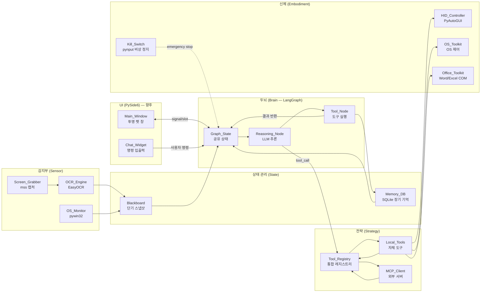

# Desktop Pet Agent — 프로젝트 폴더 구조

> **프로젝트 루트**: `d:\Desktop_Pet`
> **아키텍처**: LangGraph 기반 순환형 인지 프로세스 + MCP 통합 + PySide6 UI

```
Desktop_Pet/
│
├── environment.yml                  # Conda 환경 정의 (Python 3.11+)
├── README.md                        # 프로젝트 소개, 설치·실행 방법
├── .env.example                     # 환경변수 템플릿 (VLM 엔드포인트, 모델명 등)
├── .gitignore                       # Git 버전 관리 제외 목록
├── main.py                          # 전체 시스템 시작점 및 모듈 초기화
│
│  ╔══════════════════════════════════════════╗
│  ║  1. config/ — Configuration & Types      ║
│  ╚══════════════════════════════════════════╝
├── config/
│   ├── __init__.py
│   ├── settings.py                  # 시스템 전역 설정 및 환경 변수 관리
│   │                                # (Pydantic Settings: VLM 엔드포인트, 모델명,
│   │                                #  경로, 타임아웃, MCP 서버 목록 등)
│   ├── types_dto.py                 # 데이터 전송 객체 (Pydantic 모델)
│   │                                # ScreenState, OCRResult, ActionResult,
│   │                                # TaskRequest, AgentState 등
│   └── constants.py                 # 매직 넘버 및 에러 코드 등 열거형 상수
│                                    # (AgentStatus, ErrorCode, ToolCategory 등)
│
│  ╔══════════════════════════════════════════╗
│  ║  2. utils/ — Common Utilities            ║
│  ╚══════════════════════════════════════════╝
├── utils/
│   ├── __init__.py
│   └── logger.py                    # 프로젝트 전역 로깅 설정
│                                    # (Loguru 기반 파일/콘솔 출력, 로그 레벨 관리)
│
│  ╔══════════════════════════════════════════╗
│  ║  3. sensor/ — Perception (감지부)         ║
│  ╚══════════════════════════════════════════╝
├── sensor/
│   ├── __init__.py
│   ├── screen_grabber.py            # mss 기반 화면 캡처 (FPS 조절 가능, 멀티모니터)
│   ├── ocr_engine.py                # EasyOCR 래퍼: 텍스트 + bounding box 추출
│   │                                # → OCRResult DTO 반환
│   ├── os_monitor.py                # 활성 창 제목, 프로세스명, 마우스 좌표 수집
│   │                                # (pywin32 win32gui 활용)
│   └── stt_engine.py                # [향후] Whisper 기반 음성 인식 (Speech-to-Text)
│                                    # ※ MVP 범위 밖, 스텁(stub) 인터페이스만 정의
│
│  ╔══════════════════════════════════════════╗
│  ║  4. brain/ — Agent Logic (LangGraph)     ║
│  ╚══════════════════════════════════════════╝
├── brain/
│   ├── __init__.py
│   ├── graph_state.py               # LangGraph 그래프 간 공유 상태(TypedDict) 정의
│   │                                # → AgentGraphState: messages, tool_results,
│   │                                #   screen_state, iteration_count 등
│   ├── graph_builder.py             # LangGraph 노드/엣지 연결, 제어 흐름 구성
│   │                                # (StateGraph 빌더, 조건부 엣지 정의)
│   ├── prompts.py                   # LLM 시스템 프롬프트 및 페르소나 관리
│   │                                # (Jinja2 템플릿 또는 문자열 기반)
│   └── nodes/                       # 그래프를 구성하는 개별 실행 단위
│       ├── __init__.py
│       ├── reasoning_node.py        # LLM 기반 사고 및 다음 행동 결정
│       │                            # (ChatOllama 호출, tool_call 판단)
│       └── tool_node.py             # 결정된 도구(Tool)를 실행하는 노드
│                                    # (ToolNode 또는 커스텀 실행기)
│
│  ╔══════════════════════════════════════════╗
│  ║  5. strategy/ — Tools & MCP Client       ║
│  ╚══════════════════════════════════════════╝
├── strategy/
│   ├── __init__.py
│   ├── mcp_client.py                # MCP 서버 연결/세션 관리, 도구 목록 동기화
│   │                                # (langchain-mcp-adapters: MultiServerMCPClient)
│   ├── tool_registry.py             # 로컬 도구 + MCP 도구 통합 관리 레지스트리
│   │                                # (도구 검색, 카테고리 필터, 동적 등록/해제)
│   └── local_tools.py               # 데스크탑 제어를 위한 자체 LangChain 도구 모음
│                                    # (@tool 데코레이터: click_at, type_text,
│                                    #  press_key, take_screenshot, open_app 등)
│
│  ╔══════════════════════════════════════════╗
│  ║  6. embodiment/ — Action & OS Control    ║
│  ╚══════════════════════════════════════════╝
├── embodiment/
│   ├── __init__.py
│   ├── hid_controller.py            # 마우스/키보드 물리적 제어
│   │                                # PyAutoGUI(기본) + PyDirectInput(폴백)
│   ├── os_toolkit.py                # 프로그램 실행, 창 관리, 클립보드, 파일 I/O
│   │                                # (subprocess, pywin32, pyperclip)
│   ├── office_toolkit.py            # Word/Excel 문서 자동화 (COM 우선 전략)
│   │                                # 1차: pywin32 COM (실시간 접근, 매크로, 서식)
│   │                                # 2차 폴백: openpyxl / python-docx (파일 기반)
│   ├── kill_switch.py               # pynput 기반 비상 정지
│   │                                # Hard Kill(좌클릭 6연타) + Soft Pause(단축키)
│   └── tts_engine.py                # [향후] Coqui-TTS 또는 SoVITS 기반 음성 출력
│                                    # ※ MVP 범위 밖, 스텁 인터페이스만 정의
│
│  ╔══════════════════════════════════════════╗
│  ║  7. gui/ — PySide6 User Interface        ║
│  ╚══════════════════════════════════════════╝
├── gui/
│   ├── __init__.py
│   ├── main_window.py               # [향후] 투명 배경 데스크탑 펫 메인 캐릭터 창
│   ├── chat_widget.py               # [향후] 텍스트 입력 / 에이전트 답변 출력 UI
│   ├── tray_icon.py                 # [향후] 시스템 트레이 아이콘 및 메뉴
│   ├── workers.py                   # [향후] GUI 멈춤 방지 백그라운드 QThread
│   └── assets/                      # 캐릭터 이미지, 애니메이션 리소스
│       └── cat_sprites/             # 고양이 애니메이션 프레임 (대기/작업중/완료)
│
│  ╔══════════════════════════════════════════╗
│  ║  8. state/ — Memory & Database           ║
│  ╚══════════════════════════════════════════╝
├── state/
│   ├── __init__.py
│   ├── blackboard.py                # 단기 공유 메모리 (센서 데이터 최신 스냅샷)
│   │                                # → ScreenState, ActiveWindowInfo 보관
│   └── memory_db.py                 # SQLite 기반 장기 기억 저장소
│                                    # (태스크 로그, 오류 기록, 실행 이력)
│
│  ╔══════════════════════════════════════════╗
│  ║  9. tests/ — Unit / Integration Tests    ║
│  ╚══════════════════════════════════════════╝
├── tests/
│   ├── __init__.py
│   ├── test_sensor.py               # sensor/ 모듈 단위 테스트
│   ├── test_brain.py                # brain/ 모듈 단위 테스트
│   ├── test_embodiment.py           # embodiment/ 모듈 단위 테스트
│   └── test_integration.py          # 전체 시스템 통합 테스트
│
│  ╔══════════════════════════════════════════╗
│  ║  10. data/ — Runtime Data                ║
│  ╚══════════════════════════════════════════╝
└── data/
    ├── screenshots/                 # 캡처된 스크린샷 (디버깅/감사 로그용)
    ├── logs/                        # 애플리케이션 로그 파일
    ├── desktop_pet.db               # SQLite 장기 기억 데이터베이스 파일
    └── models/                      # [향후] STT/TTS 로컬 모델 가중치 저장소
```

---

## 폴더별 역할 요약

| # | 계층 | 폴더 | 핵심 역할 | MVP 우선순위 |
|---|------|------|----------|-------------|
| 1 | 설정 | `config/` | 환경변수, DTO, 상수 정의 | ★★★ 필수 |
| 2 | 유틸 | `utils/` | 전역 로깅 설정 | ★★★ 필수 |
| 3 | 감지 | `sensor/` | 스크린 캡처, OCR, 창 정보, (향후 STT) | ★★★ 필수 |
| 4 | 두뇌 | `brain/` | LangGraph 상태 머신, LLM 추론 노드 | ★★★ 필수 |
| 5 | 전략 | `strategy/` | Tool 레지스트리, MCP 클라이언트, 로컬 도구 | ★★★ 필수 |
| 6 | 신체 | `embodiment/` | HID 제어, OS 조작, Office 자동화, Kill Switch | ★★★ 필수 |
| 7 | UI | `gui/` | PySide6 투명 윈도우, 펫 캐릭터 | ★☆☆ 향후 |
| 8 | 상태 | `state/` | 블랙보드, 장기 기억 DB | ★★★ 필수 |
| 9 | 테스트 | `tests/` | 단위·통합 테스트 | ★★☆ 점진적 |
| 10 | 데이터 | `data/` | 스크린샷, 로그, DB 파일 | ★★★ 필수 |


---

## 데이터 흐름 개요



---

## 모듈 간 의존성 규칙

```
config/ ← 모든 모듈이 참조 (설정·DTO·상수)
utils/  ← 모든 모듈이 참조 (로깅)

sensor/      → config, utils
state/       → config, utils
brain/       → config, utils, state, strategy
strategy/    → config, utils, embodiment, sensor
embodiment/  → config, utils
gui/         → config, utils, brain, state        (향후)
tests/       → 모든 모듈
```

> **의존 방향 원칙**: 상위 계층(brain, strategy)은 하위 계층(sensor, embodiment, state)에 의존하되, 하위 계층은 상위 계층을 직접 참조하지 않습니다. 순환 의존을 방지합니다.
