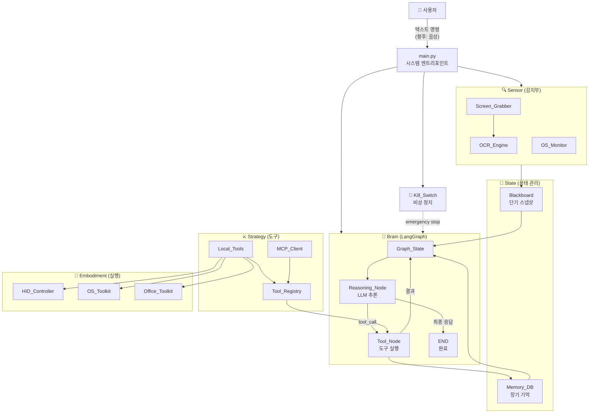
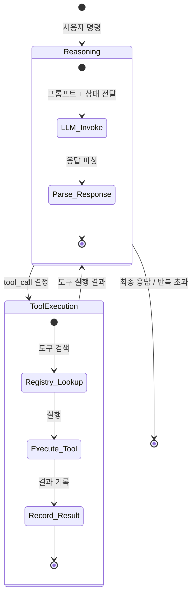
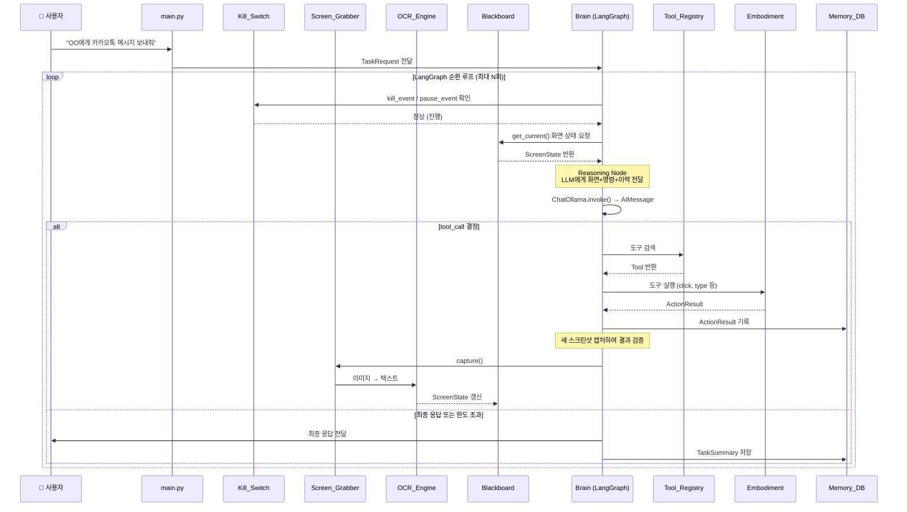
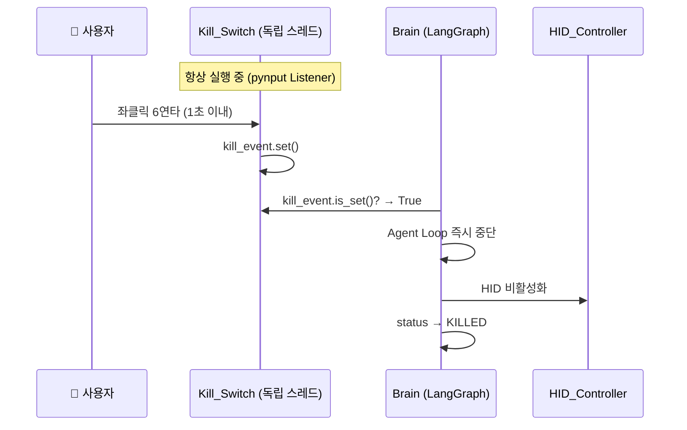

# Desktop Pet Agent — System Design Document (시스템 설계 문서)

> **버전**: 1.0  
> **최종 수정**: 2026-03-23  
> **아키텍처**: LangGraph + MCP + PySide6

---

## 1. 시스템 개요

Desktop Pet Agent는 사용자의 데스크톱 환경에 투명한 캐릭터 형태로 상주하며, 시각(Vision)과 청각(Audio)을 통해 상황을 인지하고 물리적·소프트웨어적 제어를 통해 복잡한 업무를 대행하는 **멀티모달 AI 자율 행동 에이전트**입니다.

### 1-1. 핵심 설계 원칙

| 원칙 | 설명 |
|------|------|
| **범용성 우선** | 특정 앱 API 종속 없이 "사람처럼 화면을 보고 조작"하는 CUA(Computer-Use Agent) 접근 |
| **순환형 인지** | 단순 프롬프트-응답이 아닌 LangGraph 기반 상태 공유 순환 루프 (Observe → Think → Act → Verify) |
| **무한 확장** | MCP 프로토콜을 통한 외부 도구·서비스 동적 연결 |
| **안전 최우선** | 하드웨어 킬 스위치 + 스코프 제한 + 감사 로그 |
| **점진적 구축** | 코어 에이전트 → UI → TTS/STT → 외부 연동 순으로 단계별 확장 |

### 1-2. 현재 개발 범위 (Phase 1: Core Agent)

> [!IMPORTANT]
> Phase 1은 **에이전트의 인지-추론-행동 파이프라인** 구축에 집중합니다.  
> GUI(PySide6 펫 윈도우)와 TTS/STT는 인터페이스 스텁만 정의하고 구현은 Phase 2로 연기합니다.

**Phase 1 포함**:
- 화면 캡처 + OCR 기반 시각 인지
- LangGraph 기반 순환 추론 엔진
- 마우스·키보드 HID 제어
- OS 제어 (프로그램 실행, 창 관리, 클립보드)
- Office 자동화 (Word/Excel COM 인터페이스)
- MCP 클라이언트 통합
- Kill Switch 비상 정지
- SQLite 기반 실행 이력 기록

**Phase 2 (향후)**:
- PySide6 투명 윈도우 펫 UI
- STT (Whisper 음성 인식)
- TTS (음성 합성)
- 외부 데이터베이스 연동
- 전용 앱 / 원격 접근

---

## 2. 고수준 아키텍처



---

## 3. 데이터 전송 객체 (DTO) 정의

> 모든 DTO는 `config/types_dto.py`에 Pydantic v2 모델로 정의됩니다.

### 3-1. Sensor 계층 DTO

```python
from pydantic import BaseModel, Field
from typing import Optional
from datetime import datetime


class BoundingBox(BaseModel):
    """OCR이 인식한 텍스트의 화면 위치 정보"""
    x: int = Field(..., description="좌측 상단 X 좌표 (px)")
    y: int = Field(..., description="좌측 상단 Y 좌표 (px)")
    width: int = Field(..., description="너비 (px)")
    height: int = Field(..., description="높이 (px)")

    @property
    def center(self) -> tuple[int, int]:
        """바운딩 박스의 중심 좌표 반환"""
        return (self.x + self.width // 2, self.y + self.height // 2)


class OCRTextBlock(BaseModel):
    """OCR로 인식된 개별 텍스트 블록"""
    text: str = Field(..., description="인식된 텍스트")
    bbox: BoundingBox = Field(..., description="텍스트 위치")
    confidence: float = Field(..., ge=0.0, le=1.0, description="인식 신뢰도 (0~1)")


class OCRResult(BaseModel):
    """OCR 엔진의 전체 결과"""
    text_blocks: list[OCRTextBlock] = Field(default_factory=list)
    full_text: str = Field(default="", description="모든 블록의 텍스트를 합친 전문")
    captured_at: datetime = Field(default_factory=datetime.now)
    resolution: tuple[int, int] = Field(..., description="캡처 해상도 (width, height)")

    @property
    def block_count(self) -> int:
        return len(self.text_blocks)


class ActiveWindowInfo(BaseModel):
    """현재 활성 창 정보"""
    title: str = Field(default="", description="창 제목")
    process_name: str = Field(default="", description="프로세스 이름")
    hwnd: int = Field(default=0, description="윈도우 핸들")
    rect: tuple[int, int, int, int] = Field(
        default=(0, 0, 0, 0),
        description="창 위치 (left, top, right, bottom)"
    )
    is_foreground: bool = Field(default=False, description="포그라운드 여부")


class MouseState(BaseModel):
    """마우스 현재 상태"""
    x: int = Field(default=0, description="X 좌표")
    y: int = Field(default=0, description="Y 좌표")
    screen_index: int = Field(default=0, description="모니터 인덱스")


class ScreenState(BaseModel):
    """화면 및 시스템 상태의 통합 스냅샷 — Blackboard의 핵심 단위"""
    ocr_result: Optional[OCRResult] = None
    active_window: Optional[ActiveWindowInfo] = None
    mouse_state: Optional[MouseState] = None
    screenshot_path: Optional[str] = Field(None, description="저장된 스크린샷 경로")
    timestamp: datetime = Field(default_factory=datetime.now)
```

### 3-2. Brain / Agent 계층 DTO

```python
from enum import Enum
from typing import Any


class AgentStatus(str, Enum):
    """에이전트 실행 상태"""
    IDLE = "idle"                   # 대기 중
    EXECUTING = "executing"         # 명령 실행 중
    PAUSED = "paused"              # 일시 정지 (Soft Pause)
    DONE = "done"                  # 정상 완료
    FAILED = "failed"              # 실패
    KILLED = "killed"              # 비상 정지됨


class TaskRequest(BaseModel):
    """사용자 명령 요청"""
    command: str = Field(..., description="사용자의 자연어 명령")
    context: Optional[str] = Field(None, description="추가 컨텍스트")
    max_steps: int = Field(default=15, ge=1, le=50, description="최대 실행 스텝 수")
    timeout_seconds: int = Field(default=300, ge=10, description="전체 타임아웃 (초)")


class ActionResult(BaseModel):
    """도구 실행 결과"""
    tool_name: str = Field(..., description="실행된 도구 이름")
    success: bool = Field(..., description="성공 여부")
    output: Any = Field(None, description="도구 출력값")
    error_message: Optional[str] = Field(None, description="오류 메시지")
    execution_time_ms: float = Field(default=0.0, description="실행 시간 (ms)")
    timestamp: datetime = Field(default_factory=datetime.now)


class TaskSummary(BaseModel):
    """태스크 실행 완료 후 요약"""
    task_id: str = Field(..., description="태스크 고유 ID (UUID)")
    command: str = Field(..., description="원본 사용자 명령")
    status: AgentStatus = Field(..., description="최종 상태")
    steps_executed: int = Field(default=0, description="실행된 스텝 수")
    actions: list[ActionResult] = Field(default_factory=list)
    final_response: str = Field(default="", description="사용자에게 전달할 최종 응답")
    started_at: datetime = Field(default_factory=datetime.now)
    finished_at: Optional[datetime] = None
    error_message: Optional[str] = None
```

### 3-3. LangGraph State 정의

```python
from typing import TypedDict, Annotated, Sequence
from langchain_core.messages import BaseMessage
from langgraph.graph.message import add_messages


class AgentGraphState(TypedDict):
    """LangGraph 그래프 전체에서 공유되는 상태 객체

    - messages: LLM과의 대화 기록 (HumanMessage, AIMessage, ToolMessage)
    - screen_state: 최신 화면 스냅샷 (Blackboard에서 주입)
    - iteration_count: 현재 루프 반복 횟수 (무한루프 방지)
    - agent_status: 현재 에이전트 상태
    - task_request: 원본 사용자 요청
    - action_history: 실행된 도구 결과 이력
    """
    messages: Annotated[Sequence[BaseMessage], add_messages]
    screen_state: Optional[ScreenState]
    iteration_count: int
    agent_status: AgentStatus
    task_request: Optional[TaskRequest]
    action_history: list[ActionResult]
```

### 3-4. MCP / Strategy 계층 DTO

```python
class ToolCategory(str, Enum):
    """도구 카테고리"""
    HID = "hid"                    # 마우스/키보드 물리 제어
    SENSOR = "sensor"              # 화면 캡처, OCR
    OS = "os"                      # 운영체제 제어
    FILE = "file"                  # 파일 조작
    OFFICE = "office"              # Word/Excel 자동화
    MCP = "mcp"                    # 외부 MCP 서버 도구
    UTIL = "util"                  # 유틸리티


class ToolRiskLevel(str, Enum):
    """도구 위험 등급"""
    SAFE = "safe"                  # 읽기 전용, 부작용 없음
    LOW = "low"                    # 경미한 부작용 (클릭, 타이핑)
    MEDIUM = "medium"              # 파일 생성/수정, 문서 편집
    HIGH = "high"                  # 파일 삭제/이동, 시스템 설정 변경
    CRITICAL = "critical"          # 시스템 종료, 대량 파일 조작


class ToolInfo(BaseModel):
    """레지스트리에 등록되는 도구 메타데이터"""
    name: str = Field(..., description="도구 이름")
    description: str = Field(..., description="도구 설명 (LLM에게 제공)")
    category: ToolCategory = Field(..., description="도구 카테고리")
    risk_level: ToolRiskLevel = Field(default=ToolRiskLevel.SAFE)
    enabled: bool = Field(default=True, description="활성화 여부")
    source: str = Field(default="local", description="'local' 또는 MCP 서버 이름")


class MCPServerConfig(BaseModel):
    """MCP 서버 연결 설정"""
    name: str = Field(..., description="서버 식별 이름")
    command: str = Field(..., description="서버 실행 명령어")
    args: list[str] = Field(default_factory=list, description="실행 인자")
    env: dict[str, str] = Field(default_factory=dict, description="환경 변수")
    enabled: bool = Field(default=True, description="활성화 여부")
```

### 3-5. State / Memory 계층 DTO

```python
class TaskLogEntry(BaseModel):
    """장기 기억 DB에 저장되는 태스크 실행 로그"""
    id: Optional[int] = None
    timestamp: datetime = Field(default_factory=datetime.now)
    command: str = Field(..., description="사용자 원문 명령")
    target_app: Optional[str] = Field(None, description="대상 애플리케이션")
    status: AgentStatus = Field(..., description="최종 상태")
    error_message: Optional[str] = None
    steps_count: int = Field(default=0, description="수행된 tool call 수")
    execution_time_seconds: float = Field(default=0.0, description="총 실행 시간")
    llm_model: str = Field(default="", description="사용된 LLM 모델명")
```

### 3-6. Kill Switch DTO

```python
class KillSwitchEvent(BaseModel):
    """Kill Switch 이벤트"""
    trigger_type: str = Field(..., description="'hard_kill' | 'soft_pause' | 'resume'")
    trigger_source: str = Field(..., description="'mouse_clicks' | 'keyboard_shortcut' | 'ui_button'")
    timestamp: datetime = Field(default_factory=datetime.now)
    agent_status_before: AgentStatus = Field(..., description="이벤트 발생 전 상태")
```

### 3-7. 설정 모델 (Settings)

```python
from pydantic_settings import BaseSettings


class AppSettings(BaseSettings):
    """전역 애플리케이션 설정 — .env 파일에서 로드"""

    # ── LLM ──
    vlm_endpoint: str = "http://your-ollama-host:11434"
    vlm_model: str = "gemma3:27b"
    llm_temperature: float = 0.1
    llm_max_tokens: int = 2048

    # ── Agent 제약 ──
    max_agent_steps: int = 15
    step_timeout_seconds: int = 30
    total_timeout_seconds: int = 300

    # ── Sensor ──
    screen_capture_fps: float = 1.0
    ocr_languages: list[str] = ["ko", "en"]
    ocr_confidence_threshold: float = 0.3

    # ── 안전 ──
    kill_switch_click_count: int = 6
    kill_switch_time_window: float = 1.0
    allowed_apps: list[str] = []          # 비어있으면 제한 없음
    allowed_directories: list[str] = []
    dangerous_tools_enabled: bool = False  # move_file, delete_file 등

    # ── MCP ──
    mcp_servers: list[dict] = []           # MCPServerConfig 리스트

    # ── 경로 ──
    data_dir: str = "data"
    screenshots_dir: str = "data/screenshots"
    logs_dir: str = "data/logs"
    db_path: str = "data/desktop_pet.db"

    class Config:
        env_file = ".env"
        env_prefix = "DPET_"
```

---

## 4. 모듈별 상세 설계

### 4-1. config/ — 전역 설정 & 타입 정의

| 파일 | 역할 | 핵심 내용 |
|------|------|----------|
| `settings.py` | 환경변수 관리 | `AppSettings` (Pydantic Settings), `.env` 로드, 싱글톤 패턴 |
| `types_dto.py` | 데이터 전송 객체 | 위 Section 3의 모든 Pydantic 모델 정의 |
| `constants.py` | 열거형 상수 | `AgentStatus`, `ToolCategory`, `ToolRiskLevel`, `ErrorCode` |

### 4-2. utils/ — 공통 유틸리티

| 파일 | 역할 | 핵심 내용 |
|------|------|----------|
| `logger.py` | 전역 로깅 | Loguru 기반, 파일/콘솔 이중 출력, 로그 로테이션was, 레벨별 필터링 |

```python
# utils/logger.py 핵심 구조
from loguru import logger
import sys

def setup_logger(log_dir: str = "data/logs"):
    logger.remove()  # 기본 핸들러 제거
    logger.add(sys.stderr, level="INFO", format="...")
    logger.add(f"{log_dir}/agent_{{time}}.log", rotation="10 MB", retention="7 days")
    return logger
```

### 4-3. sensor/ — 감지부

#### screen_grabber.py
```
역할: mss 라이브러리를 사용한 고속 화면 캡처
입력: monitor_index (int), region (optional tuple)
출력: PIL.Image 또는 numpy.ndarray
핵심 로직:
  1. mss.mss()로 스크린 캡처 세션 획득
  2. 지정 모니터 또는 전체 화면 캡처
  3. PIL Image로 변환하여 반환
  4. 필요 시 data/screenshots/에 파일 저장 (감사 로그)
```

#### ocr_engine.py
```
역할: EasyOCR을 활용한 텍스트 + 위치 정보 추출
입력: PIL.Image 또는 이미지 파일 경로
출력: OCRResult DTO
핵심 로직:
  1. EasyOCR Reader 인스턴스 초기화 (싱글톤, 한/영 지원)
  2. readtext() 호출 → [(bbox, text, confidence), ...] 반환
  3. confidence_threshold 이상인 결과만 필터링
  4. OCRTextBlock 리스트 + full_text 조합하여 OCRResult 반환
```

#### os_monitor.py
```
역할: 운영체제 현재 상태 수집
입력: 없음
출력: ActiveWindowInfo, MouseState
핵심 로직:
  1. win32gui.GetForegroundWindow() → 활성 창 핸들
  2. win32gui.GetWindowText(hwnd) → 창 제목
  3. psutil.Process(pid).name() → 프로세스명
  4. win32api.GetCursorPos() → 마우스 좌표
```

### 4-4. brain/ — LangGraph 에이전트 엔진

#### graph_state.py
```
역할: LangGraph 노드 간 공유 상태 타입 정의
핵심: AgentGraphState TypedDict (Section 3-3 참조)
```

#### graph_builder.py
```
역할: LangGraph StateGraph 구성 및 컴파일
핵심 로직:
  1. StateGraph(AgentGraphState) 생성
  2. 노드 등록: "reasoning" → reasoning_node, "tools" → tool_node
  3. 엣지 정의:
     - START → "reasoning"
     - "reasoning" → should_continue (조건부 엣지)
       - tool_call이 있으면 → "tools"
       - 최종 응답이면 → END
       - 반복 초과면 → END
     - "tools" → "reasoning" (결과 반환 후 재추론)
  4. graph.compile() → 실행 가능한 CompiledGraph 반환
```



#### prompts.py
```
역할: LLM 시스템 프롬프트 및 페르소나 관리
핵심 내용:
  - SYSTEM_PROMPT: 에이전트 역할, 행동 규칙, 안전 제약 정의
  - TOOL_INSTRUCTION: 도구 사용 가이드라인
  - SCREEN_CONTEXT_TEMPLATE: OCR 결과 + 활성 창 정보 포맷팅 템플릿
```

#### nodes/reasoning_node.py
```
역할: LLM을 호출하여 사고하고 다음 행동을 결정하는 노드
입력: AgentGraphState
출력: AgentGraphState (messages에 AIMessage 추가)
핵심 로직:
  1. screen_state에서 현재 화면 컨텍스트 추출
  2. messages + 화면 컨텍스트를 프롬프트로 조합
  3. ChatOllama.invoke() 호출
  4. 응답(AIMessage)을 state.messages에 추가
  5. iteration_count 증가
```

#### nodes/tool_node.py
```
역할: LLM이 결정한 도구를 실행하는 노드
입력: AgentGraphState (마지막 AIMessage에 tool_calls 포함)
출력: AgentGraphState (ToolMessage 추가, action_history 갱신)
핵심 로직:
  1. 마지막 AIMessage.tool_calls 파싱
  2. tool_registry에서 해당 도구 검색
  3. Kill Switch 상태 확인 (kill_event.is_set() → 즉시 중단)
  4. 도구 실행 및 결과 ToolMessage로 래핑
  5. action_history에 ActionResult 추가
```

### 4-5. strategy/ — 도구 & MCP 클라이언트

#### mcp_client.py
```
역할: 외부 MCP 서버와의 연결·세션 관리·도구 동기화
라이브러리: langchain-mcp-adapters (LangChain ↔ MCP 공식 어댑터)
핵심 로직:
  1. settings.mcp_servers 설정에서 MCPServerConfig 목록 로드
  2. MultiServerMCPClient 초기화:
     → 각 서버에 대해 StdioConnection 또는 SSEConnection 설정
     → stdio: command + args 지정 (로컬 MCP 서버 프로세스 실행)
     → sse: url 지정 (원격 MCP 서버 HTTP 연결)
  3. client.get_tools() → LangChain BaseTool 리스트 자동 변환
  4. 연결 상태 모니터링 및 자동 재연결 로직

사용 예시:
  from langchain_mcp_adapters.client import MultiServerMCPClient

  async with MultiServerMCPClient({
      "filesystem": {
          "command": "npx",
          "args": ["-y", "@modelcontextprotocol/server-filesystem", "D:/"],
          "transport": "stdio",
      }
  }) as client:
      tools = client.get_tools()  # → list[BaseTool]
```

#### tool_registry.py
```
역할: 로컬 도구 + MCP 도구를 통합 관리하는 중앙 레지스트리
핵심 로직:
  1. local_tools.py에서 정의된 로컬 도구 등록
  2. mcp_client.py에서 동기화된 MCP 도구 등록
  3. ToolInfo 메타데이터 기반 검색/필터링
  4. risk_level 기반 활성화/비활성화 제어
  5. get_all_tools() → LangGraph 노드에 제공할 전체 도구 목록
인터페이스:
  - register_tool(tool, info: ToolInfo) → None
  - get_tools(category: Optional[ToolCategory]) → list[BaseTool]
  - get_all_tools() → list[BaseTool]
  - enable_tool(name: str) / disable_tool(name: str)
```

#### local_tools.py
```
역할: 데스크탑 제어를 위한 LangChain @tool 정의
구현 패턴: @tool 데코레이터 → embodiment 모듈 호출 위임

MVP 도구 목록:
```

| # | Tool 이름 | 설명 | 카테고리 | 위험등급 | 위임 대상 |
|---|----------|------|---------|---------|----------|
| 1 | `click_at` | 지정 좌표(x,y) 마우스 클릭 | HID | LOW | hid_controller |
| 2 | `double_click_at` | 지정 좌표 더블 클릭 | HID | LOW | hid_controller |
| 3 | `right_click_at` | 지정 좌표 우클릭 | HID | LOW | hid_controller |
| 4 | `type_text` | 텍스트 입력 (한글: 클립보드 방식) | HID | LOW | hid_controller |
| 5 | `press_key` | 키/조합키 입력 (Enter, Tab, Alt+Tab 등) | HID | LOW | hid_controller |
| 6 | `mouse_move` | 마우스 이동 (클릭 없이) | HID | SAFE | hid_controller |
| 7 | `mouse_scroll` | 마우스 스크롤 | HID | SAFE | hid_controller |
| 8 | `take_screenshot` | 현재 화면 캡처 → OCR → 결과 반환 | SENSOR | SAFE | screen_grabber + ocr_engine |
| 9 | `get_active_window` | 활성 창 제목·프로세스 반환 | SENSOR | SAFE | os_monitor |
| 10 | `open_application` | 앱 실행 (프로세스명 또는 경로) | OS | MEDIUM | os_toolkit |
| 11 | `switch_window` | 특정 제목의 창으로 포커스 전환 | OS | LOW | os_toolkit |
| 12 | `clipboard_copy` | 텍스트를 클립보드에 복사 | OS | SAFE | os_toolkit |
| 13 | `clipboard_paste` | Ctrl+V 붙여넣기 | OS | LOW | os_toolkit |
| 14 | `list_directory` | 지정 경로의 파일/폴더 목록 | FILE | SAFE | os_toolkit |
| 15 | `move_file` | 파일 이동 (scope 제한) | FILE | HIGH | os_toolkit |
| 16 | `create_excel` | 새 Excel 파일 생성 + 데이터 기록 | OFFICE | MEDIUM | office_toolkit |
| 17 | `read_excel` | Excel 파일 읽기 | OFFICE | SAFE | office_toolkit |
| 18 | `edit_excel_cell` | Excel 특정 셀 편집 | OFFICE | MEDIUM | office_toolkit |
| 19 | `create_word_doc` | Word 문서 생성 + 내용 작성 | OFFICE | MEDIUM | office_toolkit |
| 20 | `read_word_doc` | Word 문서 내용 읽기 | OFFICE | SAFE | office_toolkit |
| 21 | `wait_seconds` | 지정 시간 대기 | UTIL | SAFE | — |

### 4-6. embodiment/ — 실행부

#### hid_controller.py
```
역할: 마우스·키보드 물리적 제어 (HID: Human Interface Device)
핵심 설계:
  1. PyAutoGUI를 기본 드라이버로 사용 (FAILSAFE=True)
  2. PyAutoGUI가 실패하는 경우 PyDirectInput으로 자동 폴백
  3. 한글 입력: 클립보드 복사 → Ctrl+V 붙여넣기 패턴
  4. 모든 동작에 적절한 딜레이 삽입 (인간 모방)
인터페이스:
  - click(x, y, button='left', clicks=1)
  - type_text(text: str, interval: float = 0.05)
  - press(key: str) / hotkey(*keys)
  - move_to(x, y, duration: float = 0.3)
  - scroll(clicks: int, x: int, y: int)
```

#### os_toolkit.py
```
역할: 운영체제 수준 조작
핵심 기능:
  1. 프로그램 실행: subprocess.Popen, os.startfile
  2. 창 관리: pywin32 SetForegroundWindow, EnumWindows
  3. 클립보드: pyperclip (get/set)
  4. 파일 I/O: shutil.move, os.listdir (scope 제한 적용)
안전 제약:
  - allowed_directories 외부 경로 접근 시 PermissionError
  - dangerous_tools_enabled=False 시 파일 삭제/이동 차단
```

#### office_toolkit.py
```
역할: Word/Excel 문서 자동화 (API 기반, HID 불필요)
핵심 설계:
  ★ COM(pywin32) 우선 전략 ★
  - 1차: pywin32 COM 인터페이스 (win32com.client)
    → Excel.Application, Word.Application 직접 제어
    → 매크로 실행, 서식 지정, 차트 생성 등 고급 기능 가능
    → 백그라운드 실행 가능 (Visible=False → 화면 점유 없음)
    → 에이전트가 실행 중인 문서에 직접 접근하여 실시간 데이터 조작 가능
  - 2차 (폴백): openpyxl / python-docx
    → COM 서버 장애 시 또는 Office 미설치 환경에서 폴백
    → 파일 기반 읽기/쓰기 (실행 중인 인스턴스 접근 불가)

  COM 초기화:
    - win32com.client.Dispatch("Excel.Application")
    - win32com.client.Dispatch("Word.Application")
    - CoInitialize/CoUninitialize 스레드 안전 처리 필수 (pythoncom)

인터페이스:
  Excel (COM 우선):
    - create_workbook(path, data: dict[str, list]) → str
    - read_workbook(path) → dict
    - edit_cell(path, sheet, cell, value) → bool
    - apply_formula(path, sheet, cell, formula) → bool
    - get_active_workbook() → dict        # COM 전용: 열려 있는 워크북 접근
    - run_macro(path, macro_name) → Any   # COM 전용: VBA 매크로 실행
  Word (COM 우선):
    - create_document(path, content: str, title: str) → str
    - read_document(path) → str
    - append_paragraph(path, text: str, style: str) → bool
    - find_replace(path, find: str, replace: str) → int  # COM 전용: 찾기/바꾸기
```

#### kill_switch.py
```
역할: 비상 정지 시스템 (독립 스레드, 항상 동작)
메커니즘:
  1. Hard Kill — 좌클릭 6연타 (1초 이내) 또는 Ctrl+Shift+Esc
     → threading.Event.set() → 모든 Agent Loop 즉시 중단
     → HID 비활성화, tool queue 플러시
  2. Soft Pause — 설정 가능한 단축키
     → pause_flag = True → Brain이 다음 tool 호출 전 대기
     → 재개 시 pause_flag = False
구현:
  - pynput.mouse.Listener: 클릭 이벤트 감시 (타임스탬프 큐)
  - pynput.keyboard.Listener: 단축키 감시
  - threading.Event: kill_event (프로세스 전역 공유)
  - threading.Event: pause_event
```

### 4-7. state/ — 상태 관리

#### blackboard.py
```
역할: 최신 센서 데이터를 보관하는 단기 공유 메모리
핵심 설계:
  - ScreenState 인스턴스를 thread-safe하게 보관
  - update(screen_state: ScreenState) → 최신 상태 갱신
  - get_current() → ScreenState: 현재 스냅샷 반환
  - threading.Lock으로 동시 접근 보호
```

#### memory_db.py
```
역할: SQLite 기반 장기 기억 저장소
핵심 설계:
  - 테이블: task_log (Section 3-5 TaskLogEntry 기반)
  - save_task_log(entry: TaskLogEntry) → int (ID 반환)
  - get_recent_logs(limit: int = 10) → list[TaskLogEntry]
  - get_logs_by_status(status: AgentStatus) → list[TaskLogEntry]
  - aiosqlite 사용 (비동기 지원)
스키마:
```

```sql
CREATE TABLE IF NOT EXISTS task_log (
    id                    INTEGER PRIMARY KEY AUTOINCREMENT,
    timestamp             TEXT    NOT NULL DEFAULT (datetime('now','localtime')),
    command               TEXT    NOT NULL,
    target_app            TEXT,
    status                TEXT    NOT NULL,
    error_message         TEXT,
    steps_count           INTEGER DEFAULT 0,
    execution_time_seconds REAL   DEFAULT 0.0,
    llm_model             TEXT    DEFAULT ''
);

CREATE INDEX idx_task_log_status ON task_log(status);
CREATE INDEX idx_task_log_timestamp ON task_log(timestamp);
```

### 4-8. gui/ — PySide6 UI (향후 구현)

> [!NOTE]
> Phase 1에서는 스텁 인터페이스만 정의합니다. 실제 구현은 Phase 2에서 수행합니다.

```
계획 개요:
  - main_window.py: QWidget + WindowStaysOnTopHint + FramelessWindowHint + 투명 배경
  - chat_widget.py: QTextEdit 기반 대화 I/O
  - tray_icon.py: QSystemTrayIcon 기반 시스템 트레이
  - workers.py: QThread 기반 Agent Loop 백그라운드 실행
  - Signal/Slot: PySide6 시그널로 Brain ↔ GUI 비동기 통신
```

---

## 5. 핵심 시퀀스 다이어그램

### 5-1. 명령 실행 전체 흐름



### 5-2. Kill Switch 동작 흐름



---

## 6. 기술 스택 요약

### 6-1. 핵심 라이브러리

| 계층 | 라이브러리 | 버전 | 용도 |
|------|----------|------|------|
| LLM 통합 | `langchain` | ≥0.3 | LLM 추상화, Tool 정의 |
| LLM 통합 | `langchain-ollama` | ≥0.3 | Ollama ↔ LangChain 브릿지 |
| Agent | `langgraph` | ≥0.2 | 상태 공유 그래프 기반 에이전트 루프 |
| MCP | `langchain-mcp-adapters` | ≥0.1 | MCP 서버 도구 ↔ LangChain Tool 자동 변환 (공식 어댑터) |
| 화면 캡처 | `mss` | ≥9.0 | 고속 스크린 캡처 |
| OCR | `easyocr` | ≥1.7 | 한/영 텍스트 인식 |
| OS API | `pywin32` | ≥306 | Windows 네이티브 API, COM 인터페이스 |
| HID | `pyautogui` | ≥0.9.54 | 마우스/키보드 제어 |
| HID 폴백 | `pydirectinput` | ≥1.0.4 | DirectInput 방식 제어 |
| Kill Switch | `pynput` | ≥1.7 | 입력 이벤트 백그라운드 감시 |
| 클립보드 | `pyperclip` | ≥1.8 | 크로스플랫폼 클립보드 |
| Excel | `openpyxl` | ≥3.1 | Excel 파일 읽기/쓰기 |
| Word | `python-docx` | ≥1.1 | Word 문서 읽기/쓰기 |
| 설정 | `pydantic` | ≥2.0 | DTO, 데이터 검증 |
| 설정 | `pydantic-settings` | ≥2.0 | 환경변수 매핑 |
| DB | `aiosqlite` | ≥0.20 | 비동기 SQLite |
| 로깅 | `loguru` | ≥0.7 | 구조화된 로깅 |
| 템플릿 | `jinja2` | ≥3.1 | 프롬프트 템플릿 |
| 이미지 | `pillow` | ≥10.0 | 이미지 처리 |
| 환경변수 | `python-dotenv` | ≥1.0 | .env 파일 로드 |

### 6-2. 향후 추가 예정 (Phase 2)

| 라이브러리 | 용도 |
|----------|------|
| `PySide6` | 투명 윈도우 펫 UI |
| `openai-whisper` 또는 `faster-whisper` | STT |
| `TTS` (Coqui) 또는 `GPT-SoVITS` | TTS |

### 6-3. 외부 서비스

| 서비스  | 용도 |
|--------|----------|
| Ollama (gemma3:27b) | LLM 추론 |

---

## 7. 안전 설계

### 7-1. 3계층 안전 체계

```
┌──────────────────────────────────────────────────┐
│  Layer 3: Scope 제한 (소프트웨어 레벨)            │
│  - 허용 앱/폴더 화이트리스트                       │
│  - 위험 도구 기본 비활성화 (opt-in)                │
│  - Tool별 risk_level 등급제                       │
├──────────────────────────────────────────────────┤
│  Layer 2: Soft Pause (소프트웨어 레벨)             │
│  - 단축키 또는 UI 버튼으로 일시 정지/재개           │
│  - pause_event → 다음 tool 호출 전 대기             │
├──────────────────────────────────────────────────┤
│  Layer 1: Hard Kill (하드웨어 레벨)               │
│  - 좌클릭 6연타 (1초 이내)                         │
│  - Ctrl+Shift+Esc 단축키                          │
│  - kill_event → 즉시 중단, HID 비활성화            │
└──────────────────────────────────────────────────┘
```

### 7-2. Agent Loop 안전 제약

| 제약 | 값 | 목적 |
|------|---|------|
| `max_agent_steps` | 15 | 무한 루프 방지 |
| `step_timeout_seconds` | 30초 | 단일 도구 행 방지 |
| `total_timeout_seconds` | 300초 (5분) | 전체 태스크 시간 제한 |
| `PyAutoGUI.FAILSAFE` | `True` | 마우스 모서리 도달 시 긴급 정지 |

---

## 8. 에러 처리 전략

### 8-1. 에러 코드 정의 (`constants.py`)

```python
class ErrorCode(str, Enum):
    # ── Sensor ──
    SCREEN_CAPTURE_FAILED = "E_SENSOR_001"
    OCR_FAILED = "E_SENSOR_002"
    WINDOW_NOT_FOUND = "E_SENSOR_003"

    # ── Brain ──
    LLM_CONNECTION_FAILED = "E_BRAIN_001"
    LLM_TIMEOUT = "E_BRAIN_002"
    MAX_STEPS_EXCEEDED = "E_BRAIN_003"
    INVALID_TOOL_CALL = "E_BRAIN_004"

    # ── Embodiment ──
    HID_FAILED = "E_EMB_001"
    APP_NOT_FOUND = "E_EMB_002"
    PERMISSION_DENIED = "E_EMB_003"
    OFFICE_COM_ERROR = "E_EMB_004"

    # ── Strategy ──
    MCP_CONNECTION_FAILED = "E_STR_001"
    TOOL_NOT_FOUND = "E_STR_002"
    TOOL_EXECUTION_FAILED = "E_STR_003"

    # ── Safety ──
    KILL_SWITCH_ACTIVATED = "E_SAFE_001"
    SCOPE_VIOLATION = "E_SAFE_002"
```

### 8-2. 에러 전파 원칙

1. **도구 실행 에러**: `ActionResult.success = False` + `error_message` 기록 → LLM에게 에러 상황 전달 → LLM이 대안 행동 결정
2. **LLM 연결 에러**: 3회 재시도 → 실패 시 `AgentStatus.FAILED` → 사용자에게 에러 보고
3. **Kill Switch**: 즉시 `AgentStatus.KILLED`, 모든 진행 중인 도구 중단
4. **Scope 위반**: 도구 실행 전 검증 → `PermissionError` → `ActionResult.error_message`에 기록
